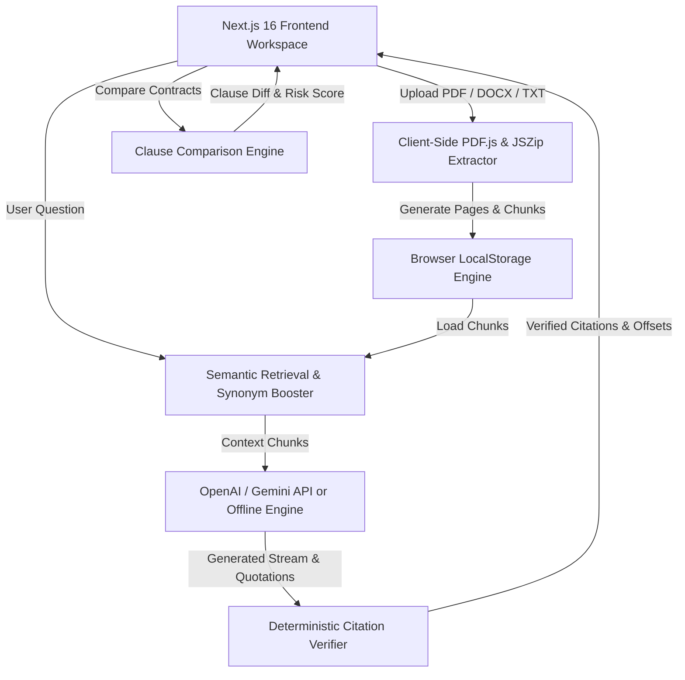

# Legal Contract Analyzer — Zero-Trust Legal AI Contract Intelligence Platform ⚖️


<div align="center">

[](https://nextjs.org/)
[](https://www.typescriptlang.org/)
[](https://tailwindcss.com/)
[](https://github.com/Dev2139/legal-contract-analyzer)
[](https://legal-contract-analyzer-theta.vercel.app/)

</div>

---

## 📌 Quick Access & Links

| Platform | Link | Description |
|---|---|---|
| 🌐 **Live Web Application** | [legal-contract-analyzer-theta.vercel.app](https://legal-contract-analyzer-theta.vercel.app/) | Deployed production app on Vercel |
| 🎬 **YouTube Demo Video** | [youtu.be/k6Hc7x1-Wu4](https://youtu.be/k6Hc7x1-Wu4) | 5-minute complete video walkthrough by Dev Patel |
| 📦 **GitHub Repository** | [github.com/Dev2139/legal-contract-analyzer](https://github.com/Dev2139/legal-contract-analyzer) | Source code, frontend modules & docs |

---

## 1. Overview

**Legal Contract Analyzer** is a **100% frontend-only, enterprise-grade web application** engineered for analyzing, querying, comparing, and researching legal contracts (PDF, DOCX, TXT agreements, and raw clause text) — with **zero backend server** and **zero database** required.

Legal contracts are notoriously long, dense, and complex. This application solves contract analysis by allowing legal professionals and business users to upload agreements and ask plain-language questions with absolute trust and transparency.

> [!IMPORTANT]
> **Zero-Trust Grounding Guarantee**: Every answer is backed by exact quotes from the contract, independently verified character-by-character by client-side verification algorithms before display. Clicking any verified citation immediately opens the contract viewer, scrolls to the target page, and highlights the quote in yellow.

### Key Capabilities
- 🚀 **100% Client-Side Engine**: Runs 100% in the browser using HTML5 LocalStorage, PDF.js, and JSZip. Zero backend hosting costs & complete data privacy.
- 🎯 **Deterministic Citation Verification**: Eliminates AI hallucinations by matching candidate quotes against raw contract character offsets.
- 🔗 **Interactive Deep-Linking**: Clicking quote cards scrolls the document viewer directly to the exact page and highlights text in yellow.
- 🔍 **Contract Version Comparison**: Substantive clause-level diffing between contract versions with legal risk scoring.
- 🤖 **Agentic Document Research**: Multi-round autonomous tool-calling research agent (`search_document`, `get_section`, `list_clauses`) with live step-by-step visual timeline.
- 🧠 **Multi-AI Provider Engine**: Works with OpenAI (`gpt-4o-mini`), Google Gemini (`gemini-1.5-flash`), or built-in offline legal reasoning engine.
- 🛡️ **PII Anonymization**: Client-side redactable PII shield for names, emails, phones, and monetary figures.

---

## 2. Assignment Coverage

Below is the verified checklist of assignment requirements mapped directly to the implemented codebase:

### Part A — Core Features
* [x] **PDF upload**: Accepts `.pdf` files up to 50MB with client-side file validation.
* [x] **DOCX upload**: Accepts `.docx` files up to 50MB with client-side file validation.
* [x] **Document processing**: Extracts text, page boundaries, and section headers into structured browser chunks.
* [x] **Processing status**: Live feedback state (`uploading` → `extracting` → `ready` or `error`).
* [x] **Scanned PDF handling**: Detects scanned/image-only PDFs lacking extractable text and informs the user clearly instead of saving empty documents.
* [x] **Document library**: Interface listing all uploaded contracts with select, view, and deletion features.
* [x] **Document deletion**: Deletes contract metadata and text chunks from local storage.
* [x] **Streaming chat**: Real-time progressive answer generation stream.
* [x] **Stop generation**: Immediate response cancellation via `AbortController` while preserving partial output history.
* [x] **Chat history**: Saves past Q&A turns per document session for easy reopening.
* [x] **Verified citations**: Zero-trust client-side verification confirming quotes exist in source document before rendering.
* [x] **Large-document handling**: Overlapping chunking strategy with page awareness and monetary pattern boosting.

### Part B — Advanced Features
* [x] **Citation highlighting**: Clicking a verified quote opens the document viewer, jumps to the exact page, and highlights the target passage.
* [x] **Multi-document questions**: Select multiple agreements to run comparative analysis and cross-document queries with document-specific citations.
* [x] **Contract comparison**: Compares two versions of a contract at clause level, identifying substantive changes and legal significance.

### Part C — Challenge Choice
* [x] **Option 2 — Agentic Document Research**: Autonomous multi-round tool-calling loop (`search_document`, `get_section`, `list_clauses`) with live timeline feedback and round safety caps.

---

## 3. Application Screenshots

### 📄 1. Document Upload & Library
*Upload PDF, DOCX, TXT files or paste raw clause text with client-side text extraction and preloaded sample contracts.*


---

### 💬 2. Streaming Chat with Verified Citations
*Ask plain-English questions, stream AI responses in real-time, and view zero-trust verified quote badges.*


---

### 🎯 3. Interactive Citation Highlighting & Page Jump
*Clicking any verified quote badge instantly opens the Document Viewer, scrolls to the target page, and highlights the passage in yellow.*


---

### 🔍 4. Substantive Contract Comparison
*Compare two contract versions at clause level with legal risk scoring, added/removed clause diffs, and financial changes.*


---

### 🤖 5. Agentic Document Research
*Autonomous multi-round research loop executing targeted tools (`search_document`, `get_section`, `list_clauses`) with a live visual timeline.*


---

## 4. Tech Stack & Architecture

### Core Technologies
- **Framework**: Next.js 16 (App Router, Turbopack, React 19)
- **Language**: TypeScript 5.0
- **Styling**: Vanilla CSS + Tailwind CSS 3.4 (Glassmorphism & Dark Mode persistence)
- **Client-Side Extraction**: `pdfjs-dist` (PDF parsing), `JSZip` (DOCX extraction)
- **State & Storage**: HTML5 `localStorage` (Zero Backend, Zero Database)
- **Deployment**: Vercel Edge Network

### Architecture Diagram



> [!NOTE]
> **Why Zero Backend Architecture?**
> 1. **Complete Data Privacy**: Your legal contracts stay on your device and are never sent to a third-party server.
> 2. **Zero Hosting Infrastructure Costs**: No MongoDB, Express server, or cloud storage costs.
> 3. **Instant Latency**: Document chunking, searching, and citation verification happen instantly in browser memory.

---

## 5. Project Structure

```text
legal-contract-analyzer/
├── client/                       # Next.js 16 Frontend Application
│   ├── app/                      # App Router pages & layout
│   │   ├── globals.css           # Global CSS tokens & dark mode styles
│   │   ├── layout.tsx            # Root HTML shell & metadata
│   │   └── page.tsx              # Main workspace page
│   ├── components/               # React UI Components
│   │   ├── AISettingsModal.tsx   # AI provider configuration modal
│   │   ├── ChatWindow.tsx        # Q&A assistant with streaming chat
│   │   ├── CitationCard.tsx      # Verified quote card component
│   │   ├── ClauseExtractor.tsx   # Auto clause extraction card
│   │   ├── ComparisonView.tsx    # Contract diff & comparison view
│   │   ├── DocumentCard.tsx      # Document library item card
│   │   ├── DocumentLibrary.tsx   # Sidebar document upload & list
│   │   ├── DocumentViewer.tsx    # Page-by-page PDF/DOCX viewer with highlight
│   │   ├── FormattedAnswer.tsx   # Markdown renderer for AI answers
│   │   ├── Header.tsx            # Top navbar with theme toggle
│   │   ├── ResearchTimeline.tsx  # Agentic research timeline feed
│   │   └── UploadDropzone.tsx    # File drag-and-drop & paste text modal
│   ├── lib/                      # Client-Side Intelligence Engines
│   │   ├── aiProvider.ts         # OpenAI & Gemini streaming API client
│   │   ├── anonymize.ts          # PII anonymization & reverse mapping
│   │   ├── api.ts                # Public API facade
│   │   ├── clientLegalEngine.ts  # Retrieval, verifier, comparator, researcher
│   │   ├── export.ts             # Export report generator
│   │   ├── storage.ts            # LocalStorage document store
│   │   └── textExtraction.ts     # PDF.js & JSZip browser extractors
│   ├── types/                    # TypeScript interfaces
│   │   └── index.ts
│   ├── .env.local                # Local environment secrets
│   ├── next.config.ts            # Next.js configuration
│   └── package.json              # Client dependencies
├── package.json                  # Root scripts
├── .env.example                  # Environment template
├── .gitignore
└── README.md                     # Documentation
```

---

## 6. Citation Verification Engine ⭐

The **Citation Verification Engine** in `client/lib/clientLegalEngine.ts` is the central trust layer of the application. The system **never trusts AI-reported page numbers or raw quotes blindly**.

```text
AI-Generated Candidate Quote
        ↓
Whitespace Normalization (Strips tabs, newlines, double spaces)
        ↓
Source Document Lookup (Searches full extracted contract text)
        ↓
Match Decision:
  ├── Exact Substring Match → Verified!
  └── Fuzzy Token Sliding Window (Levenshtein > 0.88) → Verified!
        ↓
Page & Offset Mapping (Calculates exact page index and character offsets)
        ↓
Output:
  ├── Quote Verified → Attach true page number & character bounds → Show Green Badge
  └── Quote Not Found → Mark unverified or omit
```

---

## 7. Quick Start & Local Setup

### Requirements
- **Node.js**: `v20.x` or higher
- **npm**: `v10.x` or higher

### Installation & Run Commands

```bash
# 1. Clone the repository
git clone https://github.com/Dev2139/legal-contract-analyzer.git
cd legal-contract-analyzer

# 2. Install dependencies
npm run install:all

# 3. Start development server
npm run dev
```

Open `http://localhost:3000` in your browser.

> [!TIP]
> **API Key Setup**: Click the **✨ AI Engine** button in the top navbar to set your OpenAI (`gpt-4o-mini`) or Google Gemini API key. If no key is provided, the application automatically uses the built-in offline legal reasoning engine!

---

## 8. Author & Acknowledgements

Created with ❤️ by **Dev Patel** (B.Tech Computer Science Student).

- **GitHub**: [@Dev2139](https://github.com/Dev2139)
- **Live Application**: [https://legal-contract-analyzer-theta.vercel.app/](https://legal-contract-analyzer-theta.vercel.app/)
- **Demo Video**: [https://youtu.be/k6Hc7x1-Wu4](https://youtu.be/k6Hc7x1-Wu4)